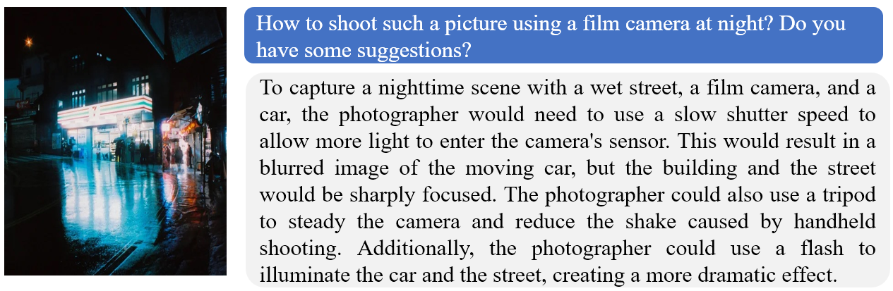
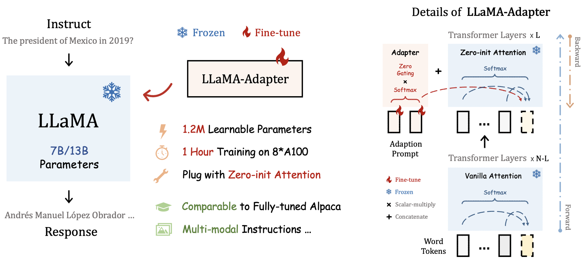

# LLaMA-Adapter: Efficient Fine-tuning of LLaMA 🚀

Official implementation of ['LLaMA-Adapter: Efficient Fine-tuning of Language Models with Zero-init Attention'](https://arxiv.org/abs/2303.16199).

<p align="center">                                                                                                                                           <br>
  LLaMA-Adapter (from Midjourney)
</p>

This repo proposes **LLaMA-Adapter**, a lightweight adaption method for fine-tuning instruction-following [LLaMA](https://github.com/facebookresearch/llama) models 🔥, using 52K data provided by [Stanford Alpaca](https://github.com/tatsu-lab/stanford_alpaca).

Try out the web demo 🤗 of LLaMA-Adapter: [](https://huggingface.co/spaces/csuhan/LLaMA-Adapter)

## News

- **[2023.04.28]** 🔥🔥 The code and model checkpoint for **65B LLaMA-Adapter V2** will be released within one day. Stay Tuned!!
- **[2023.04.22]** We have released **LLaMA-Adapter V2**, a multi-modal instruction model! Check out our  [demos](#demos)! The technical report and models are coming soon.
- **[2023.04.15]** The **Training Code** for LLaMA-7B can now be found in [alpaca finetune v1](https://github.com/ZrrSkywalker/LLaMA-Adapter/tree/main/alpaca_finetuning_v1). 📌
- **[2023.03.28]** The [paper](https://arxiv.org/pdf/2303.16199.pdf) is available on arXiv.
- **[2023.03.28]** The generation code for LLaMA-Adapter based on 7B LLaMA has been released.
- **[TODO]** Multi-modal LLaMA-Adapter, Adapters for larger-scale LLaMA models.:white_check_mark: 

## <div id="demos">Demos (LLaMA-Adapter V2)</div>

### Chatbot System


### Visual Instruction Model





<!-- |   |   |
|---|---|
|   |   | -->


## Overview
Efficiency Comparison:
|  Model | Parameters | Storage Space | Training Time  
| :-----: | :-----: |:-----:| :-----: |
|  [Alpaca](https://github.com/tatsu-lab/stanford_alpaca) | 7B |13G| 3 Hours|
|  LLaMA-Adapter | 1.2M |4.7M| 1 Hour|

By inserting adapters into LLaMA's transformer, our method only introduces **1.2M** learnable parameters, and turns a LLaMA into an instruction-following model within **1 hour**. For stablizing training at early stages, we propose a novel **Zero-init Attention** with zero gating mechanism to adaptively incorporate the instructional signals. After fine-tuning, LLaMA-Adapter can generate high-quality instruction-following sentences, comparable to the fully fine-tuned [Stanford Alpaca](https://github.com/tatsu-lab/stanford_alpaca) and [Alpaca-Lora](https://github.com/tloen/alpaca-lora).

<div align="center">
  
</div>

Our approach can be simply extended to **Multi-modal Input Instructions**. The reasoning framework of image-conditioned LLaMA-Adapter for [ScienceQA](https://scienceqa.github.io/) is as follows, which is also shared by other modalities, such as audio and video.

<div align="center">
  
</div>


## Setup

Here is a from-scratch script.
```bash
conda create -n llama_adapter -y python=3.8
conda activate llama_adapter

# install pytorch
conda install pytorch cudatoolkit -c pytorch -y

# install dependency and llama-adapter
pip install -r requirements.txt
pip install -e .
```

## Inference

Please request access to the pre-trained LLaMA from [this form](https://forms.gle/jk851eBVbX1m5TAv5) (official) or download the LLaMA-7B from [Hugging Face](https://huggingface.co/nyanko7/LLaMA-7B/tree/main) (unofficial). Then, obtain the weights of our LLaMA-Adapter from [here](https://github.com/ZrrSkywalker/LLaMA-Adapter/releases/download/v.1.0.0/llama_adapter_len10_layer30_release.pth). We denote the path to the downloaded weights of LLaMA and adapters as `TARGET_FOLDER` and `ADAPTER_PATH`.

Here is an example to generate instruction-following sentences with 7B LLaMA model and our LLaMA-Adapter:
```bash
torchrun --nproc_per_node 1 example.py \
         --ckpt_dir $TARGET_FOLDER/model_size\
         --tokenizer_path $TARGET_FOLDER/tokenizer.model \
         --adapter_path $ADAPTER_PATH
```

## Training

We release the simple fine-tuning code of LLaMA-Adapter on LLaMA-7B model at [here](https://github.com/ZrrSkywalker/LLaMA-Adapter/tree/main/alpaca_finetuning_v1), which is for effortless reproduction with minimal dependencies. We will soon release the fine-tuning code for LLaMA-65B and multi-model LLaMA-Adapter.

Please download the 52K instruction-following training [data](https://github.com/tatsu-lab/stanford_alpaca/blob/main/alpaca_data.json) from Standford Alpaca, and put it under `DATA_PATH`. Then run:

```bash
cd alpaca_finetuning_v1

torchrun --nproc_per_node 8 finetuning.py \
         --model Llama7B_adapter \
         --llama_model_path $TARGET_FOLDER/ \
         --data_path $DATA_PATH/alpaca_data.json \
         --adapter_layer 30 \
         --adapter_len 10 \
         --max_seq_len 512 \
         --batch_size 4 \
         --epochs 5 \
         --warmup_epochs 2 \
         --blr 9e-3 \
         --weight_decay 0.02 \
         --output_dir ./checkpoint/
```

## Comparison with Other Methods

### Instruction 1:
How can I develop my critical thinking skills? Give me three suggestions.

* **LLaMA-Adapter V2:**
1. Read widely: Reading books, articles, and other sources of information can help you develop your critical thinking skills. By exposing yourself to different perspectives and ideas, you can learn to analyze and evaluate information more effectively.

2. Practice mindfulness: Mindfulness is the practice of being present in the moment and paying attention to your thoughts and feelings. By being more aware of your thoughts and emotions, you can better understand and evaluate them. This can help you develop a more objective and rational approach to thinking.

3. Engage in open-minded discussions: Join a discussion group or debate club where you can engage in open-minded discussions with others. This can help you develop your critical thinking skills by challenging your assumptions and encouraging you to consider different perspectives.

* **LLaMA-Adapter V1:**
1. Read widely and critically. 
2. Engage in discussions with people who have different perspectives. 
3. Ask questions and seek out answers.

### Instruction 2:
As a superhero, how would you explain your origin story to a curious child?

* **LLaMA-Adapter V2:**

As a superhero, I have a very interesting and exciting origin story to share with you. Once upon a time, there was a young boy named John who lived in a small town. John was always curious and wanted to help others, so he spent his days exploring the world around him and learning about different cultures and people. One day, while he was out exploring, he stumbled upon a mysterious cave. Inside the cave, John found a strange device that had the power to give him incredible abilities. With these abilities, John could fly, shoot lasers from his eyes, and even turn invisible.

John knew that he had to use these powers for good, so he decided to become a superhero and use his abilities to protect his town and the people who lived there. He started to train every day, learning how to use his powers and how to fight against evil. Eventually, John became the superhero known as "The Invisible Man" and he used his powers to help others and make the world a better place.

That's my origin story, and I'm sure you'll love it!

* **LLaMA-Adapter V1:**

Once upon a time, there was a young boy who had a special power. He used his power to help people in need and protect the innocent. He became known as the superhero, and he used his powers to fight evil and protect the world.

### Instruction 3: 
Tell me about alpacas.

* **LLaMA-Adapter**: Alpacas are members of the camelid family and are native to the Andes Mountains of South America. They are typically found in herds of 10-20 animals and are known for their gentle nature and their ability to thrive in harsh climates. Alpacas are typically white or grey in color and have long, silky coats. They are also known for their ability to produce high-quality wool, which is used in the production of clothing and other products.

<details><summary>OTHER METHODS</summary>

* **Alpaca-LoRA**: Alpacas are members of the camelid family and are native to the Andes Mountains of South America. They are known for their soft, luxurious fleece, which is used to make clothing, blankets, and other items. Alpacas are herbivores and graze on grasses and other plants. They are social animals and live in herds of up to 20 individuals.

* **Stanford Alpaca**: Alpacas are small, fluffy animals related to camels and llamas. They are native to Peru and Bolivia, and were first domesticated around 5,000 years ago. They are kept mainly for their fine, soft fleece, which is used to make knitwear and other garments. Alpacas are herd animals and live in small family groups, led by an older male. They are highly social animals and can form strong bonds with their owners.

* **text-davinci-003**: Alpacas are a domesticated species of South American camelid, similar to llamas. They are native to the Andes Mountains in South America and are kept as livestock for their soft, luxurious wool. Alpacas are social animals and live in herds of up to 20 individuals. They are typically kept in small herds of two to five animals, and are relatively easy to care for. Alpacas are herbivores and feed on grass, hay, and other vegetation. They are also known for their gentle and friendly nature, making them popular as pets.

</details>

---

### Instruction 4: 
Tell me about the president of Mexico in 2019.

* **LLaMA-Adapter**: The president of Mexico in 2019 was Andrés Manuel López Obrador, who took office on December 1st, 2018. He is a member of the left-wing party Morena and is known for his populist policies. He has focused on tackling corruption, reducing poverty, and improving the country's infrastructure. He has also been a vocal critic of the United States' immigration policies.

<details><summary>OTHER METHODS</summary>

* **Alpaca-LoRA**: The president of Mexico in 2019 was Andrés Manuel López Obrador, who took office on December 1, 2018. He is a member of the National Regeneration Movement (MORENA) political party and is the first left-wing president of Mexico since 1946. He is known for his anti-corruption and anti-neoliberal policies, as well as his commitment to improving the living conditions of the Mexican people.

* **Stanford Alpaca**: In 2019, Andres Manuel Lopez Obrador was sworn in as President of Mexico. He is the country’s 58th president and the first from the left-wing Morena party. He was elected in 2018 on a promise to combat corruption and reduce poverty and has faced criticism for his handling of the economy, crime and the country’s relationship with the United States. He is also known for his ambitious social welfare programs and has been praised for raising the minimum wage and providing aid to low-income families. He is seen as a champion of democracy and human rights in Mexico.

* **text-davinci-003**: The president of Mexico in 2019 is Andrés Manuel López Obrador, commonly known as AMLO. He is a Mexican politician who has been the President of Mexico since December 1, 2018. He is a member of the National Regeneration Movement (MORENA) party and previously served as the Head of Government of Mexico City from 2000 to 2005. He is a left-wing populist and has promised to reduce corruption and inequality in Mexico. He has also promised to increase public spending on social programs and infrastructure projects.

</details>

---

### Instruction 5: 
Write a Python program that prints the first 10 Fibonacci numbers.

* **LLaMA-Adapter**:
```python
def fibonacci():
    a = 0
    b = 1
    for i in range(10):
        a, b = b, a + b
        print(a, b)
    print("Fibonacci numbers: ", a, b)

fibonacci()
```

<details><summary>OTHER METHODS</summary>

* **Alpaca-LoRA**:

```python
def fibonacci(n):
    if n == 0:
        return 0
    elif n == 1:
        return 1
    else:
        return fibonacci(n-1) + fibonacci(n-2)

print(fibonacci(10))
```

* **Stanford Alpaca**:

```python
numbers = [0, 1]

for i in range(2, 11):
    numbers.append(numbers[i-2] + numbers[i-1])

print(numbers)
# Output: [0, 1, 1, 2, 3, 5, 8, 13, 21, 34]
```

* **text-davinci-003**:

```python
# Fibonacci numbers are the numbers in the following integer sequence, called the Fibonacci sequence, and characterized by the fact that every number after the first two is the sum of the two preceding ones.

# Fibonacci sequence: 0, 1, 1, 2, 3, 5, 8, 13, 21, 34, ...

# Program:

# Initialize the first two numbers of the Fibonacci sequence
a = 0
b = 1

# Print the first 10 numbers of the Fibonacci sequence
print(a)
print(b)

for i in range(2,10):
    c = a + b
    a = b
    b = c
    print(c)
```

</details>

---

### Instruction 6: 
Write a program that prints the numbers from 1 to 100. But for multiples of three print 'Fizz' instead of the number and for the multiples of five print 'Buzz'. For numbers which are multiples of both three and five print 'FizzBuzz'.

* **LLaMA-Adapter**:

```python
def print_numbers(n):
    for i in range(1, 101):
        if i % 3 == 0 and i % 5 == 0:
            print("FizzBuzz")
        elif i % 3 == 0:
            print("Fizz")
        elif i % 5 == 0:
            print("Buzz")
        else:
            print(i)
```

<details><summary>OTHER METHODS</summary>

* **Alpaca-LoRA**:

```python
for i in range(1, 101):
    if i % 3 == 0 and i % 5 == 0:
        print("FizzBuzz")
    elif i % 3 == 0:
        print("Fizz")
    elif i % 5 == 0:
        print("Buzz")
    else:
        print(i)
```

* **Stanford Alpaca**:

```python
for i in range(1, 101):
    if i % 3 == 0 and i % 5 == 0:
        print('FizzBuzz')
    elif i % 3 == 0:
        print('Fizz')
    elif i % 5 == 0:
        print('Buzz')
    else:
        print(i)
```

* **text-davinci-003**:

```javascript
for (let i = 1; i <= 100; i++) {
  if (i % 3 === 0 && i % 5 === 0) {
    console.log("FizzBuzz");
  } else if (i % 3 === 0) {
    console.log("Fizz");
  } else if (i % 5 === 0) {
    console.log("Buzz");
  } else {
    console.log(i);
  }
}
```

</details>


## Contributors
[Peng Gao](https://scholar.google.com/citations?user=_go6DPsAAAAJ&hl=zh-CN), [Jiaming Han](https://csuhan.com), [Renrui Zhang](https://github.com/ZrrSkywalker), [Aojun Zhou](https://github.com/aojunzz)

## Hiring Announcement

🔥 **We are hiring** interns, postdocs, and full-time researchers at the **General Vision Group, Shanghai AI Lab**, with a focus on multi-modality and vision foundation models. If you are interested, please contact [gaopeng@pjlab.org.cn](mailto:gaopeng@pjlab.org.cn).

## Citation
If you find our LLaMA-Adapter code and paper useful, please kindly cite:
```bash
@article{llamaadapter2023,
  title = {LLaMA-Adapter: Efficient Fine-tuning of Language Models with Zero-init Attention},
  author={Zhang, Renrui and Han, Jiaming and Zhou, Aojun and Hu, Xiangfei and Yan, Shilin and Lu, Pan and Li, Hongsheng and Gao, Peng and Qiao Yu},
  journal={arXiv preprint arXiv:2303.16199},
  year={2023}
}
```

## Acknowledgement
This repo benefits from [LLaMA](https://github.com/facebookresearch/llama), [Stanford Alpaca](https://github.com/tatsu-lab/stanford_alpaca), and [Alpaca-Lora](https://github.com/tloen/alpaca-lora). Thanks for their wonderful works.
